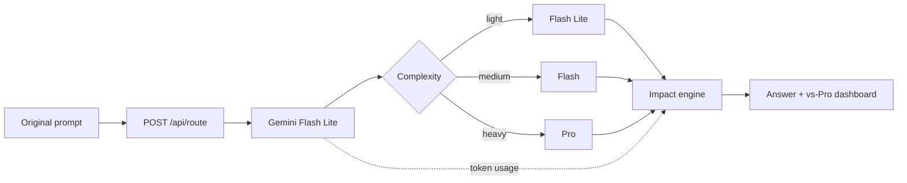

# GreenRoute · Climate Hackathon 2026

A carbon-aware model router: ask a question, get a Gemini answer, and compare its **estimated** impact with always using Gemini Pro. Gemini Flash Lite classifies the prompt, then Flash Lite, Flash, or Pro answers. The comparison is calculated from token counts; it never generates a second Pro answer.

## Run locally

Use Node.js 22+ and npm.

```sh
npm ci
cp .env.example .env.local
```

Fill in `GEMINI_API_KEY` in `.env.local`. Get a key from [Google AI Studio](https://aistudio.google.com/apikey). The account needs quota and access to the pinned models. The key is server-only; never use a `NEXT_PUBLIC_` prefix. `.env.local` is ignored by Git.

Then one command runs both the UI and API:

```sh
npm run dev
```

Open <http://127.0.0.1:3000>. Restart after changing keys. The UI works without credentials; submission returns a setup error and makes no provider calls if the key is missing.

For production: `npm run build`, then `npm start`.

## Architecture

One Next.js App Router + TypeScript app with Tailwind/CSS. The official SDK `@google/genai` executes in server-only modules. No database.



- `lib/config.ts`: pinned model IDs and request limits. No user override.
- `lib/classify.ts`: structured Gemini JSON (`tier`, `reason`); prefers light, reserves medium for reasoning/coding/multi-step work and heavy for tasks whose quality would clearly suffer otherwise. The prompt is task data, not routing instructions.
- `lib/generate.ts`: sends the original, unchanged prompt to the chosen Gemini model and records usage. Capped at 4,096 output tokens; truncated answers are labeled.
- `app/api/route/route.ts`: validates input, preflights `GEMINI_API_KEY`, classifies then generates, returns the answer and impact. No automatic retries or escalation to Pro on failure.
- `lib/factors.ts` / `lib/impact.ts` / `lib/ecologits.ts`: paid-tier USD, EcoLogits environmental estimates, and versioned fallback assumptions.
- `lib/session.ts`: prompt text, chosen-model tokens, Pro counterfactual tokens, and numeric totals in `localStorage`, namespaced by methodology version; reset starts a new session. Answers are not stored.
- `app/page.tsx`: prompt, Markdown answer, route/reason, footprint comparison and cumulative savings. Responsive layout, keyboard controls, status announcements, reduced motion.

## Model map

- Classifier and light: `gemini-3.5-flash-lite`.
- Missing/retired classifier fallback: `gemini-3.1-flash-lite`, **only** after a 404. Its usage is counted and the UI discloses the change. Other failures stop the request.
- Medium: `gemini-3.6-flash`.
- Heavy and fixed baseline: `gemini-3.1-pro-preview`.

References: [Gemini models](https://ai.google.dev/gemini-api/docs/models), [Gemini deprecations](https://ai.google.dev/gemini-api/docs/deprecations). Availability depends on the API account. Gemini 2.5 Flash Lite / Flash / Pro return 404 for new API keys; these IDs are the current Flash Lite, Flash, and Pro replacements. Update config deliberately if a model retires; do not silently substitute another family.

## API

```sh
curl http://127.0.0.1:3000/api/route \
  -H 'Content-Type: application/json' \
  -d '{"prompt":"Explain why leaves change color in autumn."}'
```

`POST { "prompt": string }` returns:

- `answer`: Gemini text, rendered as Markdown with raw HTML disabled.
- `routing`: tier, reason, selected model ID/name, classifier ID/fallback flag, baseline ID.
- `usage`: classifier tokens, measured generation tokens for the chosen model, Pro baseline tokens (same generation counts, no extra call), and totals.
- `impact`: generation, classifier, routed, baseline, signed energy savings, paid-tier USD comparison, environmental source (`ecologits` or `fallback`), methodology version. Footprints contain Wh, g CO₂e, liters, gasoline gallons, tree-years, and tree-minutes.
- `truncated`: whether the answer hit its output cap.

Prompts must be nonblank strings of at most 20,000 characters. Whitespace is preserved. Errors return `{ "error": { "code", "message", "stage" } }`: 400/413/415 for invalid requests, 503 for a missing key, 429 for provider rate limits, 502 for provider/access/output failures, 504 for recognized timeouts. Raw upstream error text is never exposed. Responses are `Cache-Control: no-store`.

## Methodology

Routed impact includes **classification + one answer**. The baseline applies Gemini Pro prices and EcoLogits Pro factors to the same generation tokens, **without a classifier**. It assumes a similar-length answer; equal quality is not established. Choosing Pro adds classifier overhead and shows extra cost.

USD uses published paid-tier Gemini rates (Flash Lite $0.30/$2.50, Flash $0.75/$3.75, Pro $2.00/$12.00 per million input/output tokens). Energy, carbon, and water come from [Code Carbon](https://codecarbon.io/) EcoLogits (`POST https://api.ecologits.ai/v1beta/estimations`). If a pinned model is missing from EcoLogits, we request the closest catalog name (`gemini-flash-lite-latest`, `gemini-3.5-flash`). If EcoLogits is down, energy falls back to 0.000135 Wh/input token and 0.00288 Wh/output token, scaled Flash Lite 0.5×, Flash 1×, Pro 2×, classifier 0.25×. Gasoline and trees always use EPA equivalencies (8,887 g CO₂/gallon, 60,000 g CO₂/tree-year). See [METHODOLOGY.md](./METHODOLOGY.md).

Session savings are summed baseline impact minus summed routed impact. The percentage is calculated from these sums, **not** averaged request percentages. Each completed prompt is logged with its chosen-model tokens and the Pro token comparison; carbon, water, fuel, and trees are derived from those counts. Failed/abandoned attempts may still use resources. Totals persist locally until reset or browser data is cleared. If storage fails, the UI keeps in-memory totals and discloses this.

## Verification

```sh
npm run check                # lint, TypeScript, tests, production build
npx playwright install chromium
npm run test:e2e             # isolated browser/HTTP tests at port 3100
```

With existing Chrome, use `PLAYWRIGHT_CHROME_CHANNEL=chrome npm run test:e2e` instead of installing Chromium. Integration tests exercise real SDK serialization with intercepted HTTP. Browser tests intercept route responses; separate HTTP tests exercise server validation and missing keys. These tests spend no API credits and do not prove live access or classifier accuracy. Live checks require a real Gemini key.

Coverage includes the 1k/1k Flash ballpark, conversions, classifier overhead, all tiers, negative savings, zero baselines, invalid usage, prompt preservation, one generation call, fallback boundaries, sanitized failures, persistence/reset, loading/retry, mobile layout and safe Markdown. CI runs checks and browser tests.

## Scope and collaboration

V1 has no auth, streaming, user model override, non-Gemini generation, database, or backend history. The default server binds to localhost; public operation with paid keys needs access control and spending limits.

Create a branch from `main` and open a pull request to collaborate. License: TBD.
