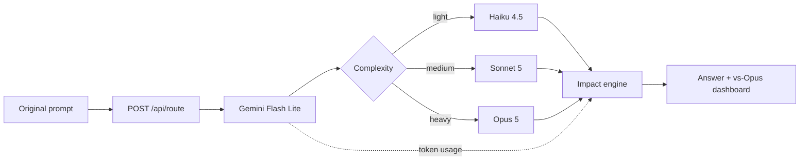

# Canopy · Climate Hackathon 2026

A carbon-aware model router: ask a question, get a Claude answer, and compare its **estimated** impact with always using Opus. Gemini Flash Lite chooses the smallest suitable model. The comparison is calculated from token counts; it never generates a second answer.

## Run locally

Use Node.js 22+ and npm.

```sh
npm ci
cp .env.example .env.local
```

Fill in `GEMINI_API_KEY` and `ANTHROPIC_API_KEY` in `.env.local`. Get keys from [Google AI Studio](https://aistudio.google.com/apikey) and the [Anthropic console](https://console.anthropic.com/). Both accounts need quota and access to the pinned models. Keys are server-only; never use `NEXT_PUBLIC_` prefixes. `.env.local` is ignored by Git.

Then one command runs both the UI and API:

```sh
npm run dev
```

Open <http://127.0.0.1:3000>. Restart after changing keys. The UI works without credentials; submission returns a setup error and makes no provider calls if either key is missing.

For production: `npm run build`, then `npm start`.

## Architecture

One Next.js App Router + TypeScript app with Tailwind/CSS. Official SDKs `@google/genai` and `@anthropic-ai/sdk` execute in server-only modules. No database.



- `lib/config.ts`: pinned model IDs and request limits. No user override.
- `lib/classify.ts`: structured Gemini JSON (`tier`, `reason`); prefers light, reserves medium for reasoning/coding/multi-step work and heavy for tasks whose quality would clearly suffer otherwise. The prompt is task data, not routing instructions.
- `lib/generate.ts`: sends the original, unchanged prompt to Claude and records usage. Capped at 4,096 output tokens; truncated answers are labeled.
- `app/api/route/route.ts`: validates input, preflights both keys, sequences providers, returns the answer and impact. No automatic retries or escalation to Opus on failure.
- `lib/factors.ts` / `lib/impact.ts`: versioned assumptions and pure calculations.
- `lib/session.ts`: numeric totals in `localStorage`, namespaced by methodology version; reset starts a new session. Prompts/answers are not stored.
- `app/page.tsx`: prompt, Markdown answer, route/reason, footprint comparison and cumulative savings. Responsive layout, keyboard controls, status announcements, reduced motion.

## Model map

- Classifier: `gemini-2.5-flash-lite`.
- Missing/retired classifier fallback: `gemini-3.1-flash-lite-preview`, **only** after a 404. Its usage is counted and the UI discloses the change. Other failures stop the request.
- Light: `claude-haiku-4-5`.
- Medium: `claude-sonnet-5`.
- Heavy and fixed baseline: `claude-opus-5`.

References: [Claude models](https://platform.claude.com/docs/en/models/overview), [Gemini Flash Lite](https://ai.google.dev/gemini-api/docs/models/gemini-2.5-flash-lite), [Gemini deprecations](https://ai.google.dev/gemini-api/docs/deprecations). The project brief flags October 20, 2026 for 2.5 retirement; verify the provider schedule before deployment. Availability also depends on the API account. Update config deliberately if the preview retires; do not silently substitute another family.

## API

```sh
curl http://127.0.0.1:3000/api/route \
  -H 'Content-Type: application/json' \
  -d '{"prompt":"Explain why leaves change color in autumn."}'
```

`POST { "prompt": string }` returns:

- `answer`: Claude text, rendered as Markdown with raw HTML disabled.
- `routing`: tier, reason, selected model ID/name, classifier ID/fallback flag, baseline ID.
- `usage`: classifier, generation, and total input/output token counts.
- `impact`: generation, classifier, routed, baseline, signed savings, percent savings, methodology version. Footprints contain Wh, g CO₂e, liters, gasoline gallons, tree-years, and tree-minutes.
- `truncated`: whether the answer hit its output cap.

Prompts must be nonblank strings of at most 20,000 characters. Whitespace is preserved for both providers. Errors return `{ "error": { "code", "message", "stage" } }`: 400/413/415 for invalid requests, 503 for missing keys, 429 for provider rate limits, 502 for provider/access/output failures, 504 for recognized timeouts. Raw upstream error text is never exposed. Responses are `Cache-Control: no-store`.

## Methodology

Routed impact includes **classification + one answer**. The baseline applies Opus factors to the same generation tokens, **without a classifier**. It assumes a similar-length answer; equal quality is not established. Choosing Opus adds classifier overhead and shows extra impact. Classification can also outweigh savings for a very short Haiku answer.

The Sonnet reference is 0.000135 Wh/input token and 0.00288 Wh/output token. Scales: Haiku 0.5×, Sonnet 1×, Opus 2×, classifier 0.25×. Conversions: 0.287 g CO₂e/Wh, a prototype water assumption of 1.8 L/kWh, 8,887 g CO₂/gallon gasoline, 60,000 g CO₂/tree-year. See [METHODOLOGY.md](./METHODOLOGY.md) for provenance, equations, a worked example and limitations.

Session savings are summed baseline impact minus summed routed impact. The percentage is calculated from these sums, **not** averaged request percentages. Completed requests only are counted; failed/abandoned attempts may still use resources. Totals persist locally until reset or browser data is cleared. If storage fails, the UI keeps in-memory totals and discloses this.

## Verification

```sh
npm run check                # lint, TypeScript, tests, production build
npx playwright install chromium
npm run test:e2e             # isolated browser/HTTP tests at port 3100
```

With existing Chrome, use `PLAYWRIGHT_CHROME_CHANNEL=chrome npm run test:e2e` instead of installing Chromium. Integration tests exercise real SDK serialization with intercepted HTTP. Browser tests intercept route responses; separate HTTP tests exercise server validation and missing keys. These tests spend no API credits and do not prove live access or classifier accuracy. Live checks require both real keys.

Coverage includes the 1k/1k Sonnet ballpark, conversions, classifier overhead, all tiers, negative savings, zero baselines, invalid usage, prompt preservation, one generation call, fallback boundaries, sanitized failures, persistence/reset, loading/retry, mobile layout and safe Markdown. CI runs checks and browser tests.

## Scope and collaboration

V1 has no auth, streaming, user model override, non-Claude generation, database, or backend history. Both providers receive the prompt. The default server binds to localhost; public operation with paid keys needs access control and spending limits.

Create a branch from `main` and open a pull request to collaborate. License: TBD.
