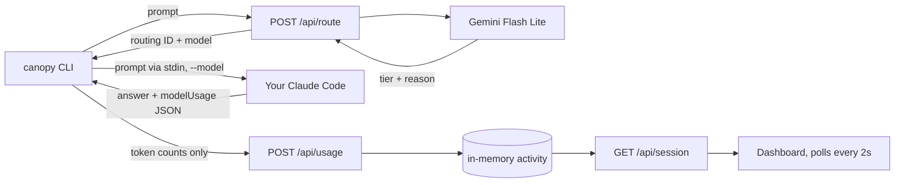

# Canopy · Climate Hackathon 2026

A carbon-aware chat for **your own Claude Code**. Chat in the web page. Each message is classified by Gemini Flash Lite and routed to the smallest suitable Claude model. Your installed Claude Code answers it in the background, with your normal sign-in and its tools switched off. Next to the conversation, Canopy compares each answer's **estimated** impact with always using Opus. The comparison is calculated from token counts; no second answer is generated.

A `canopy` terminal command runs the same router for people who prefer the terminal. It uses your full Claude Code setup, and its runs count in the same totals.

## Run locally

Needs Node.js 22+, npm, and [Claude Code](https://code.claude.com/docs) installed and signed in (`claude` on your PATH; run it once and use `/login`).

```sh
npm ci
cp .env.example .env.local   # then set GEMINI_API_KEY
npm run build && npm start   # dashboard + API at http://127.0.0.1:3000
```

Get a Gemini key from [Google AI Studio](https://aistudio.google.com/apikey). It stays on the local server and never reaches Claude Code. No Anthropic API key is needed. Restart after changing `.env.local`. (`npm run dev` also works where file watching is allowed.)

Open <http://127.0.0.1:3000> and start chatting. Follow-up messages continue the same Claude Code conversation, even when they're routed to a different model. **New chat** starts a fresh one.

### Chat mode

The server runs `claude -p --model <selected> --output-format json --tools "" --strict-mcp-config` in an empty temporary folder, adding `--resume <session>` for follow-ups. With no tools, no MCP servers and no project files, a web page can never read files or run commands on your machine. It also keeps Claude Code's per-message overhead small: about 7k tokens, versus about 30k with tools. Conversations live in the page and in Claude Code's own session store; reloading the page starts a new chat.

### Terminal launcher

In another terminal, from this folder:

```sh
npm run ask -- "Explain why leaves change color in autumn."
echo "Summarize this" | npm run ask
npm run ask -- --dry-run "Design a fault-tolerant carbon ledger"   # routing only, no Claude usage
```

Or install the command globally with `npm link`, then run `canopy "…"`.

The answer prints to stdout; Canopy's routing and impact notes print to stderr, so answers can be piped. Open <http://127.0.0.1:3000> to watch runs arrive.

### Launcher options

| Option | Meaning |
| --- | --- |
| `--resume <session-id>` | Continue a Claude Code session (the ID is printed after each run) |
| `--continue` | Continue the most recent Claude Code session in this folder |
| `--allowed-tools "Read Grep"` | Tools Claude Code may use without asking |
| `--server <url>` | Canopy server; must be localhost (default `http://127.0.0.1:3000`, or `$CANOPY_URL`) |
| `--dry-run` | Show the routing decision without running Claude Code |

**Permissions.** The launcher runs `claude -p --model <selected> --output-format json --permission-prompts none`. Headless mode has no one to answer permission prompts, so anything that would prompt is **denied**, and your permission mode and settings still apply. Pre-approve specific tools with `--allowed-tools` or your Claude Code settings. Canopy never passes `--dangerously-skip-permissions`.

**Cost.** Runs count against your own Claude Code plan or API billing, exactly as if you ran `claude -p` yourself. Check your plan's terms for programmatic use.

## Architecture



- `cli/canopy.mjs`: the launcher. Uses `spawn` with an argument array (no shell). Passes the prompt through stdin. Strips `GEMINI_API_KEY` and `CANOPY_*` from Claude Code's environment. `cli/lib.mjs` has the pure, tested helpers.
- `app/api/chat` + `lib/claude-code.ts`: the web chat. Validates the prompt and optional session ID, classifies, runs tool-less Claude Code, and returns the answer plus impact. Only numbers go to the activity store.
- `app/api/route`: localhost-only. Validates the prompt, classifies it with Gemini, and records a routing decision. `/api/classify` is an alias. No generation happens here.
- `app/api/usage`: accepts per-model token counts, or a failure, for a routing ID. It is idempotent and computes impact from the models Claude Code actually reported.
- `app/api/session`: the configuration flag plus the latest 100 runs. Holds numbers and routing only; prompts and answers are never stored or sent here.
- `lib/activity.ts`: an in-memory store with at most 200 runs. Runs still pending after an hour are marked failed. It resets when the server restarts. There is no database.
- `lib/classify.ts`, `lib/factors.ts`, `lib/impact.ts`: the classifier, frozen factors, and pure calculations.
- `lib/session.ts`: browser totals in `localStorage`. They are deduplicated by routing ID, so polling and reloads never double count. Reset keeps the counted IDs.
- `app/page.tsx`: the chat UI, with routing badge and reason on each reply, Markdown answers, per-reply impact (click to inspect), cumulative totals, and the methodology.
- All API routes check the real `Host` header (Next normalizes `request.url`), which blocks DNS rebinding. They reject cross-origin browser requests and send `Cache-Control: no-store`.

## Model map

- Classifier: `gemini-3.1-flash-lite` (stable), with minimal thinking. The fallback `gemini-2.5-flash-lite` is used **only** after a 404. Google has closed 2.5 to new API users, so the fallback only helps older keys.
- Light `claude-haiku-4-5`, medium `claude-sonnet-5`, heavy and fixed baseline `claude-opus-5`.
- Claude Code may use additional models in a run, for example for subagents or background tasks, or it may substitute one. The dashboard shows every model it reported and flags a mismatch. Impact uses the reported models. A model family with no factor is rejected rather than guessed.

References: [Claude models](https://platform.claude.com/docs/en/models/overview), [Claude Code headless mode](https://code.claude.com/docs/en/headless), [Gemini deprecations](https://ai.google.dev/gemini-api/docs/deprecations).

## API

```sh
curl -s http://127.0.0.1:3000/api/route -H 'Content-Type: application/json' -d '{"prompt":"Explain leaves."}'
curl -s http://127.0.0.1:3000/api/usage -H 'Content-Type: application/json' \
  -d '{"id":"<routing id>","status":"completed","durationMs":2300,"models":[{"model":"claude-haiku-4-5","inputTokens":10,"outputTokens":45,"cacheReadInputTokens":28381,"cacheCreationInputTokens":9317}]}'
curl -s http://127.0.0.1:3000/api/session
```

- `POST /api/route {prompt}` returns `{id, createdAt, routing, usage.classifier, classifierImpact, methodologyVersion}`.
- `POST /api/usage` takes `{id, status: "completed", models, durationMs}`, or `{id, status: "failed", reason}`, where `reason` is one of `cli_error`, `missing_usage`, `cancelled`, `launch_failed`, `dry_run`. A completed report returns the full `RouteResult` with impact.
- `GET /api/session` returns `{configured, activities}`.

Errors return `{ "error": { "code", "message", "stage" } }` with status 400/413/415 for invalid input, 403 for a non-local request, 404 for an unknown ID, 409 for a run already failed, 422 for an unsupported model, 429/502/504 for classifier problems, and 503 for a missing key. Raw provider errors are never exposed.

## Methodology

Routed impact = classifier + **everything Claude Code reported for the run**, summed per model. Cache reads and cache writes count as full input tokens. The Opus baseline applies Opus factors to the same tokens, without a classifier. Choosing Opus, or a run where Claude Code itself used Opus, shows extra impact. See [METHODOLOGY.md](./METHODOLOGY.md) for factors, equations, the worked example, and limitations, including why Claude Code's cached system prompt dominates short runs.

## Verification

```sh
npm run check                                     # lint, TypeScript, unit tests, production build
PLAYWRIGHT_CHROME_CHANNEL=chrome npm run test:e2e # or `npx playwright install chromium` first
```

- Unit tests cover the API contract with the real Gemini SDK over intercepted HTTP, and the activity store (idempotency, expiry, bounds).
- They also cover impact math, including the golden example, cache accounting, and mixed models, plus session deduplication.
- The real launcher is tested end to end against a fake `claude` (`tests/fixtures/fake-claude.mjs`) and a fake server. That covers stdin prompts, no shell interpolation, environment scrubbing, login errors, missing usage, malformed output, a missing executable, Ctrl-C, and dry runs.
- Browser tests exercise the dashboard with mocked `/api/session` data, and the real HTTP endpoints without a key.
- None of these tests spend provider credits. Live use needs a Gemini key and a signed-in Claude Code.

## Scope

V1 is single-user and local: no auth, no database, no server-side chat history, no streaming, and no tools in chat mode. Gemini and your Claude Code both receive the prompt. The dashboard only ever sees token counts.

Collaborate on a branch from `main` via pull request. License: TBD.
